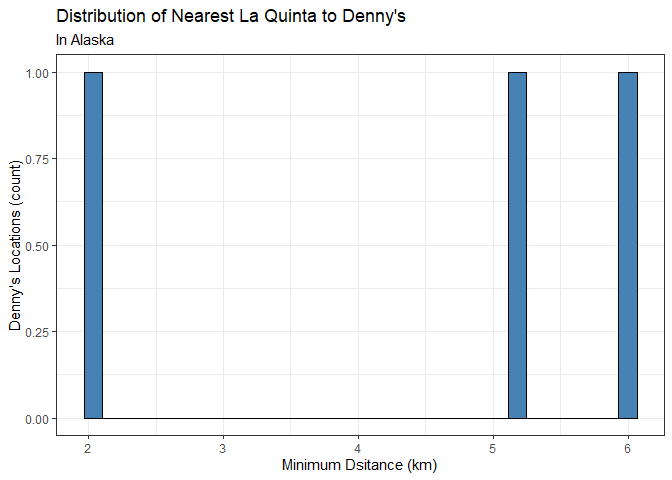

Lab 05 - La Quinta is Spanish for next to Denny’s, Pt. 2
================
Tsion
02/16/2026

### Load packages and data

``` r
library(tidyverse) 
library(readr) 
library(dsbox)
```

\#Not sure why dsbox is not working for me, had to manually load the
data files again.

``` r
states <- read_csv("data/states.csv")
dennys <- read_csv("data/dennys.csv")
laquinta <- read_csv("data/laquinta.csv")
```

``` r
dn <- dennys
lq <- laquinta
```

``` r
names(dn)
```

    ## [1] "address"   "city"      "state"     "zip"       "longitude" "latitude"

``` r
names(lq)
```

    ## [1] "address"   "city"      "state"     "zip"       "longitude" "latitude"

### Exercise 1

``` r
dn_ak <- dn %>%
  filter (state == "AK")
nrow(dn_ak)
```

    ## [1] 3

``` r
lq_ak <- lq %>%
  filter (state == "AK")
nrow(lq_ak)
```

    ## [1] 2

There are 3 Denny’s and 2 La Quinta locations in the state of Alaska.

### Exercise 2

``` r
nrow(dn_ak) * nrow(lq_ak)
```

    ## [1] 6

There are 6 pairings between all Denny’s and all La Quinta locations in
Alaska.

### Exercise 3

``` r
# we want to keep all rows and columns from both data frames. 
dn_lq_ak <- full_join(dn_ak, lq_ak,
    by = "state")
```

    ## Warning in full_join(dn_ak, lq_ak, by = "state"): Detected an unexpected many-to-many relationship between `x` and `y`.
    ## ℹ Row 1 of `x` matches multiple rows in `y`.
    ## ℹ Row 1 of `y` matches multiple rows in `x`.
    ## ℹ If a many-to-many relationship is expected, set `relationship =
    ##   "many-to-many"` to silence this warning.

``` r
dn_lq_ak
```

    ## # A tibble: 6 × 11
    ##   address.x     city.x state zip.x longitude.x latitude.x address.y city.y zip.y
    ##   <chr>         <chr>  <chr> <chr>       <dbl>      <dbl> <chr>     <chr>  <chr>
    ## 1 2900 Denali   Ancho… AK    99503       -150.       61.2 3501 Min… Ancho… 99503
    ## 2 2900 Denali   Ancho… AK    99503       -150.       61.2 4920 Dal… Fairb… 99709
    ## 3 3850 Debarr … Ancho… AK    99508       -150.       61.2 3501 Min… Ancho… 99503
    ## 4 3850 Debarr … Ancho… AK    99508       -150.       61.2 4920 Dal… Fairb… 99709
    ## 5 1929 Airport… Fairb… AK    99701       -148.       64.8 3501 Min… Ancho… 99503
    ## 6 1929 Airport… Fairb… AK    99701       -148.       64.8 4920 Dal… Fairb… 99709
    ## # ℹ 2 more variables: longitude.y <dbl>, latitude.y <dbl>

### Exercise 4

``` r
nrow(dn_lq_ak)
```

    ## [1] 6

``` r
names(dn_lq_ak)
```

    ##  [1] "address.x"   "city.x"      "state"       "zip.x"       "longitude.x"
    ##  [6] "latitude.x"  "address.y"   "city.y"      "zip.y"       "longitude.y"
    ## [11] "latitude.y"

There are 6 observations in the joined data frame. The variables are
address, city, state, zip, longitude, and latitiude for each pairing of
Denny’s and La Quinta labbelled as (x) and (y) for all variables (except
state).

### Exercise 5

\#We use the mutate function to add new variable to a data frame while
keeping other viarbales constant.

### Exercise 6

``` r
haversine <- function(long1, lat1, long2, lat2, round = 3) {
  # convert to radians
  long1 <- long1 * pi / 180
  lat1 <- lat1 * pi / 180
  long2 <- long2 * pi / 180
  lat2 <- lat2 * pi / 180

  R <- 6371 # Earth mean radius in km

  a <- sin((lat2 - lat1) / 2)^2 + cos(lat1) * cos(lat2) * sin((long2 - long1) / 2)^2
  d <- R * 2 * asin(sqrt(a))

  return(round(d, round)) # distance in km
}
```

``` r
dn_lq_ak <- dn_lq_ak %>%
  mutate (
    distance = haversine(longitude.x,latitude.x,
                         longitude.y, latitude.y)
  )
```

The following are the calculated distances between all pairs of Denny’s
and La Quinta locations in Alaska: 2.035, 416.031, 5.998, 413.653,
419.879, 5.197.

### Exercise 7

``` r
#Group by Denny’s locations and calculate a new variable for min.distance. 
dn_lq_ak_minidist <- dn_lq_ak %>%
  group_by(address.x) %>%
  summarise(
    mini_dist = min(distance, na.rm = TRUE), 
    .groups = "drop"
  )

dn_lq_ak_minidist
```

    ## # A tibble: 3 × 2
    ##   address.x        mini_dist
    ##   <chr>                <dbl>
    ## 1 1929 Airport Way      5.20
    ## 2 2900 Denali           2.04
    ## 3 3850 Debarr Road      6.00

### Exercise 8

``` r
#Describe distribution
summary(dn_lq_ak_minidist)
```

    ##   address.x           mini_dist    
    ##  Length:3           Min.   :2.035  
    ##  Class :character   1st Qu.:3.616  
    ##  Mode  :character   Median :5.197  
    ##                     Mean   :4.410  
    ##                     3rd Qu.:5.598  
    ##                     Max.   :5.998

``` r
#visualization
ggplot(dn_lq_ak_minidist, aes(x = mini_dist)) + 
  geom_histogram( fill = "steelblue", color = "black") +
labs (
  title = "Distribution of nearest La Quinta to Denny's",
  subtitle = "In Alaska",
  x = "Minimum Dsitance (km)",
  y = "Denny's Locations (count)",
) + 
  theme_bw()
```

    ## `stat_bin()` using `bins = 30`. Pick better value `binwidth`.

<!-- -->

### Exercise 9

### Exercise 10

### Exercise 11

### Exercise 12
