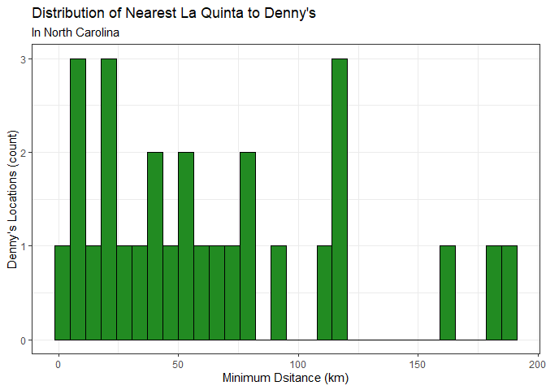
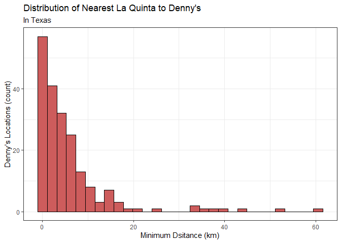
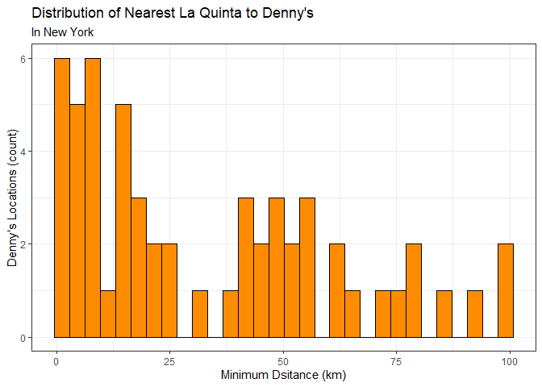

Lab 05 - La Quinta is Spanish for next to Denny’s, Pt. 2
================
Tsion
02/16/2026

### Load packages and data

``` r
library(tidyverse) 
library(readr) 
library(dsbox)
```

\#Not sure why dsbox is not working for me, had to manually load the
data files again.

``` r
states <- read_csv("data/states.csv")
dennys <- read_csv("data/dennys.csv")
laquinta <- read_csv("data/laquinta.csv")
```

``` r
dn <- dennys
lq <- laquinta
```

``` r
names(dn)
```

    ## [1] "address"   "city"      "state"     "zip"       "longitude" "latitude"

``` r
names(lq)
```

    ## [1] "address"   "city"      "state"     "zip"       "longitude" "latitude"

### Exercise 1

``` r
dn_ak <- dn %>%
  filter (state == "AK")
nrow(dn_ak)
```

    ## [1] 3

``` r
lq_ak <- lq %>%
  filter (state == "AK")
nrow(lq_ak)
```

    ## [1] 2

There are 3 Denny’s and 2 La Quinta locations in the state of Alaska.

### Exercise 2

``` r
nrow(dn_ak) * nrow(lq_ak)
```

    ## [1] 6

There are 6 pairings between all Denny’s and all La Quinta locations in
Alaska.

### Exercise 3

``` r
# we want to keep all rows and columns from both data frames. 
dn_lq_ak <- full_join(dn_ak, lq_ak,
    by = "state")
```

    ## Warning in full_join(dn_ak, lq_ak, by = "state"): Detected an unexpected many-to-many relationship between `x` and `y`.
    ## ℹ Row 1 of `x` matches multiple rows in `y`.
    ## ℹ Row 1 of `y` matches multiple rows in `x`.
    ## ℹ If a many-to-many relationship is expected, set `relationship =
    ##   "many-to-many"` to silence this warning.

``` r
dn_lq_ak
```

    ## # A tibble: 6 × 11
    ##   address.x     city.x state zip.x longitude.x latitude.x address.y city.y zip.y
    ##   <chr>         <chr>  <chr> <chr>       <dbl>      <dbl> <chr>     <chr>  <chr>
    ## 1 2900 Denali   Ancho… AK    99503       -150.       61.2 3501 Min… Ancho… 99503
    ## 2 2900 Denali   Ancho… AK    99503       -150.       61.2 4920 Dal… Fairb… 99709
    ## 3 3850 Debarr … Ancho… AK    99508       -150.       61.2 3501 Min… Ancho… 99503
    ## 4 3850 Debarr … Ancho… AK    99508       -150.       61.2 4920 Dal… Fairb… 99709
    ## 5 1929 Airport… Fairb… AK    99701       -148.       64.8 3501 Min… Ancho… 99503
    ## 6 1929 Airport… Fairb… AK    99701       -148.       64.8 4920 Dal… Fairb… 99709
    ## # ℹ 2 more variables: longitude.y <dbl>, latitude.y <dbl>

### Exercise 4

``` r
nrow(dn_lq_ak)
```

    ## [1] 6

``` r
names(dn_lq_ak)
```

    ##  [1] "address.x"   "city.x"      "state"       "zip.x"       "longitude.x"
    ##  [6] "latitude.x"  "address.y"   "city.y"      "zip.y"       "longitude.y"
    ## [11] "latitude.y"

There are 6 observations in the joined data frame. The variables are
address, city, state, zip, longitude, and latitiude for each pairing of
Denny’s and La Quinta labbelled as (x) and (y) for all variables (except
state).

### Exercise 5

\#We use the mutate function to add new variable to a data frame while
keeping other viarbales constant.

### Exercise 6

``` r
haversine <- function(long1, lat1, long2, lat2, round = 3) {
  # convert to radians
  long1 <- long1 * pi / 180
  lat1 <- lat1 * pi / 180
  long2 <- long2 * pi / 180
  lat2 <- lat2 * pi / 180

  R <- 6371 # Earth mean radius in km

  a <- sin((lat2 - lat1) / 2)^2 + cos(lat1) * cos(lat2) * sin((long2 - long1) / 2)^2
  d <- R * 2 * asin(sqrt(a))

  return(round(d, round)) # distance in km
}
```

``` r
dn_lq_ak <- dn_lq_ak %>%
  mutate (
    distance = haversine(longitude.x,latitude.x,
                         longitude.y, latitude.y)
  )
```

The following are the calculated distances between all pairs of Denny’s
and La Quinta locations in Alaska: 2.035, 416.031, 5.998, 413.653,
419.879, 5.197.

### Exercise 7

``` r
#Group by Denny’s locations and calculate a new variable for min.distance. 
dn_lq_ak_minidist <- dn_lq_ak %>%
  group_by(address.x) %>%
  summarise(
    mini_dist = min(distance, na.rm = TRUE), 
    .groups = "drop"
  )

dn_lq_ak_minidist
```

    ## # A tibble: 3 × 2
    ##   address.x        mini_dist
    ##   <chr>                <dbl>
    ## 1 1929 Airport Way      5.20
    ## 2 2900 Denali           2.04
    ## 3 3850 Debarr Road      6.00

### Exercise 8

``` r
#Describe distribution
summary(dn_lq_ak_minidist)
```

    ##   address.x           mini_dist    
    ##  Length:3           Min.   :2.035  
    ##  Class :character   1st Qu.:3.616  
    ##  Mode  :character   Median :5.197  
    ##                     Mean   :4.410  
    ##                     3rd Qu.:5.598  
    ##                     Max.   :5.998

``` r
#visualization
ggplot(dn_lq_ak_minidist, aes(x = mini_dist)) + 
  geom_histogram( fill = "steelblue", color = "black") +
labs (
  title = "Distribution of Nearest La Quinta to Denny's",
  subtitle = "In Alaska",
  x = "Minimum Dsitance (km)",
  y = "Denny's Locations (count)",
) + 
  theme_bw()
```

    ## `stat_bin()` using `bins = 30`. Pick better value `binwidth`.

<!-- -->

### Exercise 9: North Carolina

``` r
dn_nc <- dn %>%
  filter(state == "NC")

lq_nc <- lq %>%
  filter(state == "NC")
```

There are 28 Denny’s and 12 La Quinta locations in North Carolina.

``` r
nrow(dn_nc) * nrow(lq_nc)
```

    ## [1] 336

``` r
dn_lq_nc <- full_join(dn_nc, lq_nc, by = "state")
```

    ## Warning in full_join(dn_nc, lq_nc, by = "state"): Detected an unexpected many-to-many relationship between `x` and `y`.
    ## ℹ Row 1 of `x` matches multiple rows in `y`.
    ## ℹ Row 1 of `y` matches multiple rows in `x`.
    ## ℹ If a many-to-many relationship is expected, set `relationship =
    ##   "many-to-many"` to silence this warning.

``` r
dn_lq_nc <- dn_lq_nc %>%
  mutate(
    distance = haversine(longitude.x, latitude.x,
                         longitude.y, latitude.y)
  )
```

``` r
dn_lq_nc_minidist <- dn_lq_nc %>%
  group_by(address.x) %>%
  summarise(
    mini_dist = min(distance, na.rm = TRUE),
    .groups = "drop"
  )
dn_lq_nc_minidist
```

    ## # A tibble: 28 × 2
    ##    address.x                 mini_dist
    ##    <chr>                         <dbl>
    ##  1 1 Regent Park Boulevard       108. 
    ##  2 101 Wintergreen Dr            120. 
    ##  3 103 Sedgehill Dr               26.7
    ##  4 1043 Jimmie Kerr Road          36.1
    ##  5 1201 S College Road           188. 
    ##  6 1209 Burkemount Avenue         39.1
    ##  7 1493 Us Hwy 74-A Bypass        70.1
    ##  8 1524 Dabney Dr                 59.5
    ##  9 1550 Four Seasons             115. 
    ## 10 1800 Princeton-Kenly Road      55.9
    ## # ℹ 18 more rows

``` r
#describe distribution 

summary(dn_lq_nc_minidist)
```

    ##   address.x           mini_dist      
    ##  Length:28          Min.   :  1.779  
    ##  Class :character   1st Qu.: 22.388  
    ##  Mode  :character   Median : 53.456  
    ##                     Mean   : 65.444  
    ##                     3rd Qu.: 93.985  
    ##                     Max.   :187.935

``` r
#visualize
ggplot(dn_lq_nc_minidist, aes(x = mini_dist)) + 
  geom_histogram( fill = "forestgreen", color = "black") +
labs (
  title = "Distribution of Nearest La Quinta to Denny's",
  subtitle = "In North Carolina",
  x = "Minimum Dsitance (km)",
  y = "Denny's Locations (count)",
) + 
  theme_bw()
```

    ## `stat_bin()` using `bins = 30`. Pick better value `binwidth`.

<!-- -->

### Exercise 10: Texas

``` r
dn_tx <- dn %>%
  filter(state == "TX")

lq_tx <- lq %>%
  filter(state == "TX")
```

There are 200 Denny’s and 237 La Quinta locations in Texas.

``` r
nrow(dn_tx) * nrow(lq_tx)
```

    ## [1] 47400

``` r
dn_lq_tx <- full_join(dn_tx, lq_tx, by = "state")
```

    ## Warning in full_join(dn_tx, lq_tx, by = "state"): Detected an unexpected many-to-many relationship between `x` and `y`.
    ## ℹ Row 1 of `x` matches multiple rows in `y`.
    ## ℹ Row 1 of `y` matches multiple rows in `x`.
    ## ℹ If a many-to-many relationship is expected, set `relationship =
    ##   "many-to-many"` to silence this warning.

``` r
dn_lq_tx <- dn_lq_tx %>%
  mutate(
    distance = haversine(longitude.x, latitude.x,
                         longitude.y, latitude.y)
  )
```

``` r
dn_lq_tx_minidist <- dn_lq_tx %>%
  group_by(address.x) %>%
  summarise(
    mini_dist = min(distance, na.rm = TRUE),
    .groups = "drop"
  )
dn_lq_tx_minidist
```

    ## # A tibble: 200 × 2
    ##    address.x             mini_dist
    ##    <chr>                     <dbl>
    ##  1 100 Cottonwood           33.6  
    ##  2 100 E Pinehurst           1.39 
    ##  3 100 Us Highway 79 S      33.9  
    ##  4 101 N Fm 707             10.3  
    ##  5 1011 Beltway Parkway     14.0  
    ##  6 1015 Spur 350 West        1.74 
    ##  7 1015 West Main St         1.10 
    ##  8 10367 Highway 59         37.6  
    ##  9 10433 N Central Expwy     0.618
    ## 10 105 W 42nd St             6.88 
    ## # ℹ 190 more rows

``` r
#describe distribution 

summary(dn_lq_tx_minidist)
```

    ##   address.x           mini_dist      
    ##  Length:200         Min.   : 0.0160  
    ##  Class :character   1st Qu.: 0.7305  
    ##  Mode  :character   Median : 3.3715  
    ##                     Mean   : 5.7918  
    ##                     3rd Qu.: 6.6303  
    ##                     Max.   :60.5820

``` r
#visualize
ggplot(dn_lq_tx_minidist, aes(x = mini_dist)) + 
  geom_histogram( fill = "indianred", color = "black") +
labs (
  title = "Distribution of Nearest La Quinta to Denny's",
  subtitle = "In Texas",
  x = "Minimum Dsitance (km)",
  y = "Denny's Locations (count)",
) + 
  theme_bw()
```

    ## `stat_bin()` using `bins = 30`. Pick better value `binwidth`.

<!-- -->

### Exercise 11: New York

``` r
dn_ny <- dn %>%
  filter(state == "NY")

lq_ny <- lq %>%
  filter(state == "NY")
```

There are 56 Denny’s and 19 La Quinta locations in Texas.

``` r
nrow(dn_ny) * nrow(lq_ny)
```

    ## [1] 1064

``` r
dn_lq_ny <- full_join(dn_ny, lq_ny, by = "state")
```

    ## Warning in full_join(dn_ny, lq_ny, by = "state"): Detected an unexpected many-to-many relationship between `x` and `y`.
    ## ℹ Row 1 of `x` matches multiple rows in `y`.
    ## ℹ Row 1 of `y` matches multiple rows in `x`.
    ## ℹ If a many-to-many relationship is expected, set `relationship =
    ##   "many-to-many"` to silence this warning.

``` r
dn_lq_ny <- dn_lq_ny %>%
  mutate(
    distance = haversine(longitude.x, latitude.x,
                         longitude.y, latitude.y)
  )
```

``` r
dn_lq_ny_minidist <- dn_lq_ny %>%
  group_by(address.x) %>%
  summarise(
    mini_dist = min(distance, na.rm = TRUE),
    .groups = "drop"
  )
dn_lq_ny_minidist
```

    ## # A tibble: 56 × 2
    ##    address.x             mini_dist
    ##    <chr>                     <dbl>
    ##  1 1 River St                56.0 
    ##  2 103 Elwood Davis Road     47.1 
    ##  3 10390 Bennet Road         74.4 
    ##  4 1078 Glenwood Avenue       6.4 
    ##  5 114 Wolf Road              5.4 
    ##  6 1142 Arsenal St           99.0 
    ##  7 1143 Deer Park Ave        19.6 
    ##  8 118 Victory Highway       93.8 
    ##  9 1250 Upper Front St        7.16
    ## 10 126 Troy Rd               15.0 
    ## # ℹ 46 more rows

``` r
#describe distribution 

summary(dn_lq_ny_minidist)
```

    ##   address.x           mini_dist     
    ##  Length:56          Min.   : 1.281  
    ##  Class :character   1st Qu.: 7.381  
    ##  Mode  :character   Median :24.158  
    ##                     Mean   :33.575  
    ##                     3rd Qu.:53.265  
    ##                     Max.   :99.044

``` r
#visualize
ggplot(dn_lq_ny_minidist, aes(x = mini_dist)) + 
  geom_histogram( fill = "darkorange", color = "black") +
labs (
  title = "Distribution of Nearest La Quinta to Denny's",
  subtitle = "In New York",
  x = "Minimum Dsitance (km)",
  y = "Denny's Locations (count)",
) + 
  theme_bw()
```

    ## `stat_bin()` using `bins = 30`. Pick better value `binwidth`.

<!-- -->

### Exercise 12

Among all the states I have examined, Mitch Hedberg’s joke is most
likely to hold true in Texas. The histogram shows a postive skew showing
that for most of Denny’s, there is a La Quinta nearby.

Alaska has too few locations to make a concrete judgement. The histogram
for North Carolina looks to be the most spread out, which makes it the
least likely to work with the joke? Pretty much same with New York, the
histograms are lot more spread out compared to Texas, but it also
appears to show some skew? It’s very hard to say it holds true for the
joke though.
